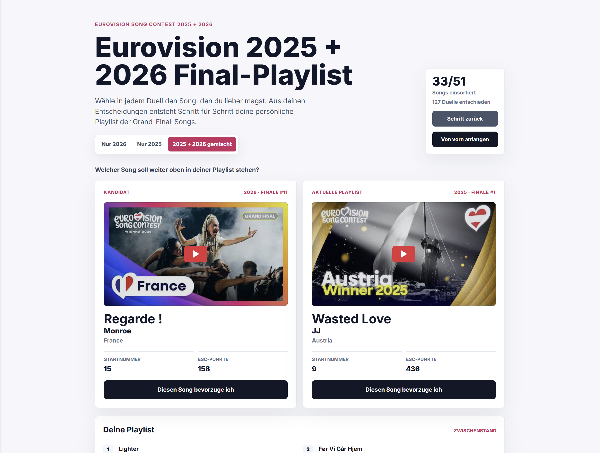

# Eurovision Final-Playlist

Build your personal Eurovision ranking by choosing your favorite song in head-to-head duels.

**[Open the full app](https://rwetzold.github.io/eurovision-playlist/)** — free to use in your browser, with no installation or account required. The app interface is in German.



## How it works

- Rank the 2025 finalists, the 2026 finalists, or all 51 songs together.
- Choose the song you prefer in each duel to build your personal ordered playlist.
- Play embedded YouTube videos while comparing songs and in your finished playlist.
- Undo a choice with **Schritt zurück**, or reset the selected ranking with **Von vorn anfangen**.
- Return later: progress and undo history are saved separately for each song selection in your browser.

Your playlist lives in the app; it does not create a playlist in a YouTube account. Progress is stored in local storage on the current browser and device, and is lost if you clear site data. Local development and the hosted app have separate saved progress.

## Run locally

Install [Node.js](https://nodejs.org/) 24 and Git, then run:

```sh
git clone https://github.com/rwetzold/eurovision-playlist.git
cd eurovision-playlist
npm ci
npm run dev
```

Open the local URL printed by Vite. No environment variables, API keys, or backend setup are needed.

```sh
npm test          # Run the test suite
npm run build    # Build the static site into dist/
npm run preview  # Serve the production build locally
```

Serve the build over HTTP using the preview command or a static host rather than opening the HTML file directly.

## Deployment

GitHub Actions installs the locked dependencies, runs tests, and builds the app for pull requests and pushes to `main`. Successful pushes to `main` deploy the full app to GitHub Pages. You can also run the workflow manually from the Actions tab on `main`.

For your own fork, enable **Settings → Pages → Build and deployment → Source: GitHub Actions**, enable workflows if needed, and run the workflow on `main`. Update the app and clone links in this README for your account.

Other static hosts can run `npm ci && npm run build` and publish `dist/`. Relative asset paths support hosting beneath a subdirectory. Do not commit `dist/` or `node_modules/`.

## Project and contributions

The app uses plain JavaScript and CSS, [Vite](https://vite.dev/) for development and builds, and [Vitest](https://vitest.dev/) for tests.

- `src/songs.js`: song metadata, YouTube video IDs, and year selections.
- `src/main.js` and `src/styles.css`: interface and styling.
- Other modules in `src/`: ranking, shuffling, undo, persistence, and video URLs.
- `tests/`: automated behavior tests.

To correct or add song data, edit `src/songs.js`, preserve existing song IDs so saved rankings can resolve them, and update the relevant tests. Open an issue for a bug or suggestion, or submit a pull request with a short explanation and the results of `npm test` and `npm run build`.

## Media and privacy

The app has no backend or application analytics. Ranking choices are stored locally. Thumbnails are loaded from YouTube, and clicking a video loads a YouTube privacy-enhanced embed; these requests connect your browser to YouTube services. Internet access is required for videos and thumbnails. Playback depends on regional availability, embedding permissions, and browser settings.

This is an unofficial fan project, not affiliated with or endorsed by the Eurovision Song Contest or the EBU. Videos, thumbnails, song titles, artist names, and trademarks belong to their respective owners. The source-code license does not grant rights to third-party media shown in the app or screenshot.

## Credits and license

Created by **Robert Wetzold and Anton Wetzold**.

The project code is available under the [MIT License](LICENSE).
